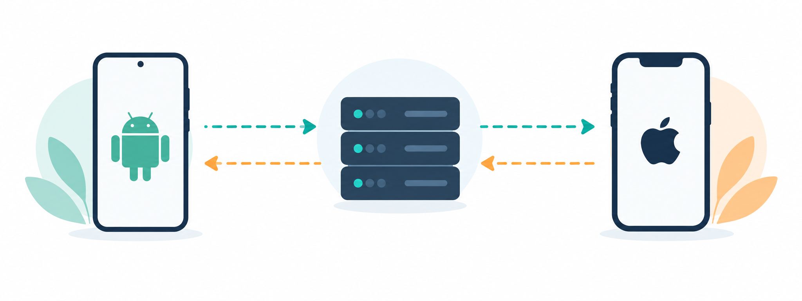
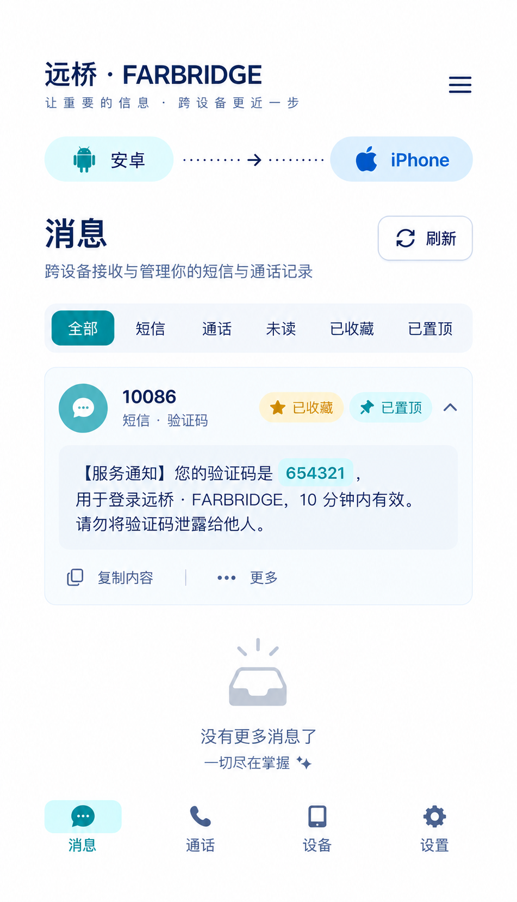

# FarBridge Relay · 远桥

Keep important SMS and call records available across devices

[简体中文](README.md) · [English](README.en.md) · [Releases](https://github.com/Apageoflove/farbridge-relay/releases)

> **Sanitized public repository** — no production URL, IP address, account, password, device secret, Bark/VAPID private key, database, log, or personal data is included. The live deployment is separate from this repository.

## Overview

FarBridge Relay is a self-hosted Android → relay server → iPhone Safari/PWA communication mirror. The Android client submits SMS, call, and status events; the server authenticates, deduplicates, retains short-lived records, and sends notifications; the iPhone client presents the newest messages and calls.

## iPhone / Safari PWA

Sanitized UI preview: newest-first records, expandable SMS, favorites, pinning, and refresh. No device frame or four-corner table border.

## Features

- Offline Android event queue with retry after network recovery
- Server authentication, event de-duplication, device state audit, and bounded retention
- Separate iPhone message/call views; newest first; expandable full SMS content
- Favorites, pinning, copy, list-only deletion, and manual refresh
- Optional Safari Web Push and Bark fallback with privacy-mode lock-screen alerts

## Download and use

Get these files from [Releases](https://github.com/Apageoflove/farbridge-relay/releases):

- farbridge-relay-android-v1.0.9.apk — Android application package
- farbridge-relay-ios-safari-setup.md — offline iPhone Safari/PWA setup guide
- SHA256SUMS.txt — APK integrity checksum

iPhone uses Safari/PWA rather than a fabricated IPA. Open your own HTTPS address in Safari, sign in, choose **Share → Add to Home Screen**, then enable Web Push in the project settings. For a fallback, copy the device code or full URL from Bark into **Settings → Bark**, save, and send a test.

## Generate your own keys

Keep real keys only in the target server's deploy/secrets.env or a password manager; never commit them.

- Device key: python -c "import secrets; print(secrets.token_urlsafe(48))"
- Android signing: create and keep a local keytool keystore; never upload the keystore or password.
- Safari Web Push: install py-vapid, then run vapid --gen and vapid --applicationServerKey.
- Bark: copy the device code or full URL from your own Bark app.

Read [Architecture](docs/ARCHITECTURE.md), [Android permissions](docs/ANDROID_PERMISSIONS.md), [iPhone setup](docs/IPHONE_SETUP.md), the detailed [operator guide (Chinese)](docs/OPERATOR_GUIDE.zh-CN.md), [Acceptance checklist](docs/ACCEPTANCE.md), and [Security and release boundary](docs/RELEASE_SAFETY.md) before production use.

## Build locally

Clone https://github.com/Apageoflove/farbridge-relay.git, enter the android directory, then run gradle testDebugUnitTest and gradle assembleRelease. No Gradle Wrapper is bundled; use a Gradle release compatible with Android Gradle Plugin 8.9.1.

## Production boundary

Publishing or downloading GitHub content does not modify the live deployment. Before a production change, back up, health-check, stage, smoke-test, and retain a rollback version. Redact SMS bodies, phone numbers, verification codes, device IDs, tokens, and server addresses before sharing logs or screenshots.
