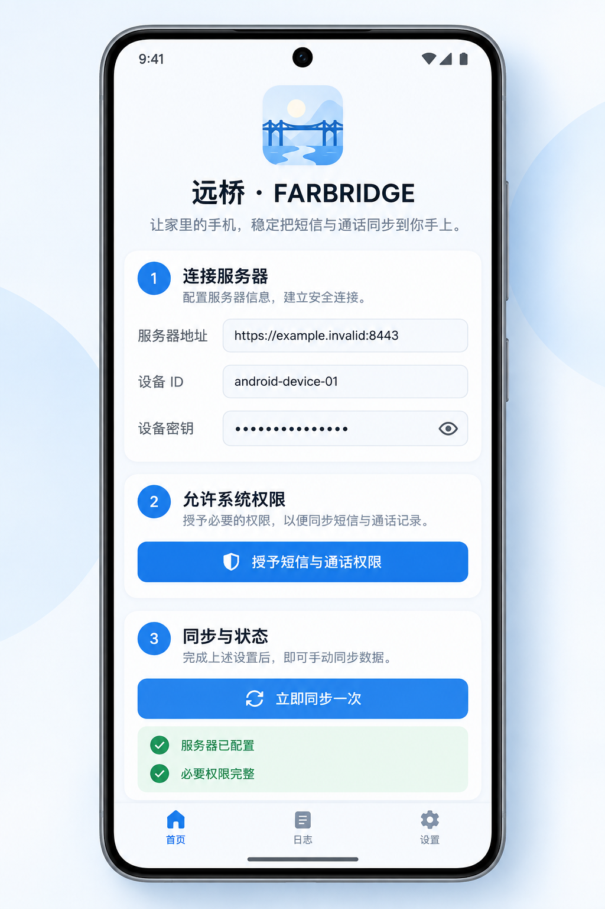

# 远桥 · Yuanqiao Relay

> 让重要的短信与通话记录，跨设备抵达你手上。

远桥（Yuanqiao Relay）是一个中文优先、可自托管的“安卓采集端 → 中继服务 → iPhone Safari/PWA”项目。安卓手机负责读取并上送短信与通话事件；服务端负责认证、去重、加密设置、短期保留和通知；iPhone 通过 Safari 或添加到主屏幕的 PWA 查看最新记录。


> 本仓库是可审计的脱敏源码副本。它不包含任何真实域名、IP、账号、密码、设备密钥、Bark key、推送私钥、数据库、日志、APK 或个人信息。

## 1.0.9 版本预览

下面两张图是与当前 Android `1.0.9` 设计对齐的脱敏 UI 预览，不是某个用户的真实设备截图，也不包含真实域名、账号、号码、验证码或密钥。预览重点展示：iPhone 端最新消息置顶、单条消息展开、收藏/置顶状态，以及 Android 端密码显示按钮和同步状态。

<table>
  <tr>
    <td width="50%"><br><sub>iPhone / Safari PWA：消息展开、收藏、置顶、刷新</sub></td>
    <td width="50%"><br><sub>Android 1.0.9：服务器、设备密钥、权限与同步状态</sub></td>
  </tr>
</table>

## 功能

- 安卓短信、通话事件同步到自托管服务。
- 服务端按事件 ID 去重，断网时由安卓端排队，恢复网络后继续提交。
- iPhone 端消息与电话分栏，最新内容优先；单条短信可展开查看完整原文。
- iPhone 端支持收藏、置顶和列表删除；收藏内容由用户主动删除前保留。
- 可选 Web Push 与 Bark 提醒；默认采用隐私模式，锁屏只提示收到新消息/验证码。
- 设备状态、同步失败、权限状态和服务健康检查可审计。
- 配置、数据库、日志和密钥与源码分离，适合个人或小范围自托管。

## 目录

- `android/`：Android 采集端源码，当前版本 `1.0.9`。
- `server/`：API、认证、同步、消息/通话镜像及保留策略。
- `web/`：iPhone Safari/PWA 前端。
- `contracts/`：客户端与服务端共享的接口契约和 fixture。
- `deploy/`：部署模板；真实配置只能由操作者在目标环境创建。
- `docs/`：架构、安全、测试、恢复与发布边界说明。

## 快速开始

### 1. 获取源码

```bash
git clone https://github.com/<your-account>/yuanqiao-relay.git
cd yuanqiao-relay
```

仓库建议使用 `yuanqiao-relay` 作为 slug；账号、可见性和域名由仓库所有者自行决定。

### 2. 生成服务端配置

复制模板，只在目标服务器的受控目录填写真实值：

```bash
cp deploy/env.example deploy/secrets.env
chmod 600 deploy/secrets.env
```

使用项目脚本生成基础随机值和 Argon2id 管理员密码哈希。密码通过临时环境变量传入，不要把密码写进命令行历史：

```bash
python -m pip install -e './server' -i https://pypi.tuna.tsinghua.edu.cn/simple
read -r -s PHONE_MIRROR_ADMIN_PASSWORD
export PHONE_MIRROR_ADMIN_PASSWORD
python tools/generate_secrets.py
unset PHONE_MIRROR_ADMIN_PASSWORD
```

将命令输出中的 `ENCRYPTION_KEY`、`SESSION_SECRET`、`ADMIN_PASSWORD_HASH` 和设备随机值写入目标环境的 `deploy/secrets.env`。`DEVICE_SECRETS_JSON` 中的设备 ID 与 Android 端保持一致，设备密钥至少 32 个随机字符。不要把填好后的 `secrets.env` 提交到 GitHub。

### 3. 自己生成 Android APK 签名

公开仓库不附带任何人的签名私钥。首次发布时在本地生成自己的 keystore，并将密码放在密码管理器中：

```bash
mkdir -p android/keystore
keytool -genkeypair -v \
  -keystore android/keystore/release.keystore \
  -alias yuanqiao-relay -keyalg RSA -keysize 2048 -validity 10950
```

在 `android/keystore/keystore.properties` 填入本机值（文件已被 Git 忽略）：

```properties
storeFile=release.keystore
storePassword=<your-keystore-password>
keyAlias=yuanqiao-relay
keyPassword=<your-key-password>
```

构建并安装：

```bash
cd android
gradle testDebugUnitTest
gradle assembleRelease
```

APK 位于 `android/app/build/outputs/apk/release/`。每个使用者都应使用自己的签名；更换签名会影响 Android 覆盖升级，请保留自己的 keystore 备份，但绝不上传它。

仓库不携带 Gradle Wrapper；本机构建机请安装与 Android Gradle Plugin 8.9.1 兼容的 Gradle 发行版，并先运行 `gradle --version` 确认环境。

### 4. 自己生成 Safari Web Push 密钥

Safari/PWA 的推送密钥是服务端的 VAPID 公钥与私钥，不是项目作者提供的固定密码。目标服务器或独立密钥环境中安装 `py-vapid` 后生成：

```bash
python -m pip install py-vapid -i https://pypi.tuna.tsinghua.edu.cn/simple
vapid --gen
vapid --applicationServerKey
```

把生成结果分别填到 `VAPID_PRIVATE_KEY`、`VAPID_PUBLIC_KEY`，并设置唯一的 `VAPID_SUBJECT`（例如 `mailto:operator@example.invalid`）。私钥只放在受控的 `secrets.env`；公钥可由已登录的 PWA 配置使用。iPhone 必须通过 HTTPS 打开站点，并从 Safari 添加到主屏幕后再启用 Web Push。

### 5. 可选 Bark

在 Bark App 中复制自己的设备码或完整地址，只填写到目标环境的 `BARK_KEY`，并设置 `BARK_ENABLED=true`。Bark key 不由本项目生成，不能写入 README、截图、Issue、日志或 Git 历史。建议保持 `BARK_PRIVACY_MODE=true`，避免验证码出现在锁屏通知中。

## 构建与验证

服务端本地检查：

```bash
python -m pip install -e './server[test]' -i https://pypi.tuna.tsinghua.edu.cn/simple
cd server
python -m pytest -q
cd ..
bash scripts/verify-layout.sh
```

前端依赖与构建命令见 `web/package.json`；Android 单元测试与 release 构建见上文。发布前请完整阅读：

- [架构说明](docs/ARCHITECTURE.md)
- [iPhone 设置](docs/IPHONE_SETUP.md)
- [Android 权限](docs/ANDROID_PERMISSIONS.md)
- [验收清单](docs/ACCEPTANCE.md)
- [安全边界](docs/SECURITY.md)
- [发布安全说明](docs/RELEASE_SAFETY.md)

## 生产安全边界

- GitHub 仓库是脱敏源码副本，不是线上数据备份。
- GitHub 发布、下载、查看或构建不会修改任何线上 `/data/phone-mirror` 文件、数据库、容器、反向代理或其他项目。
- 真实域名、IP、账号、密码、设备密钥、Bark key、VAPID 私钥、数据库、日志、APK 和 keystore 都必须留在使用者自己的目标环境。
- 短信和验证码属于敏感信息。分享截图、Issue 或日志前，必须去除正文、号码、验证码、设备标识和访问令牌。
- 生产变更前先备份、健康检查、灰度验证并保留回滚版本；不要直接在运行中的服务器执行未经审阅的 `git pull`。

## 许可证

本仓库当前未预置许可证。公开发布前，请仓库所有者补充适合自己的许可证和第三方依赖声明。
